# Welcome Elixir

> Guieline to unleash your developer's journey using Elixir. 🎇

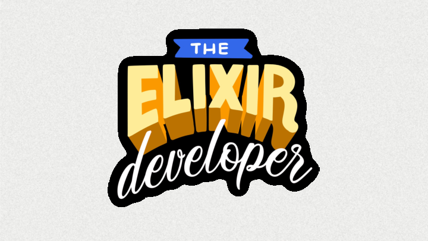

Pequeña guía introductoria en español sobre Elixir. Si este contenido es útil para ti, considera dejar una ⭐️ para saberlo.

## 1. Erlang como lenguaje de programación

- Elixir pertenece a la familia de los lenguajes de la máquina virtual de Erlang BEAM.
- Erlang es un lenguaje de programación de la familia de `pure message passing`.
- Fue un lenguaje construído en el laboratorio de CS de Ericsson en los años 80's.
- La idea inicial era construir una implementación de prolog con `message passing`.
- Erlang nace como una solución para crear sistemas de telecomunicaciones.
- Fue creado por Joe Armstrong, Robert Virding y Mike Williams.

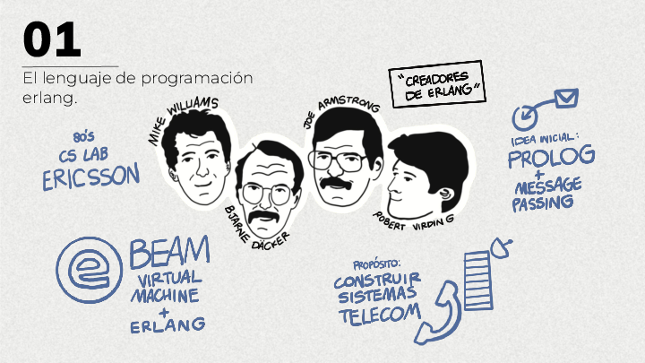

## 2. Erlang para sistemas de telecomunicaciones

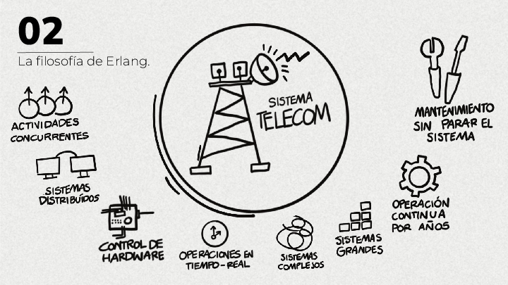

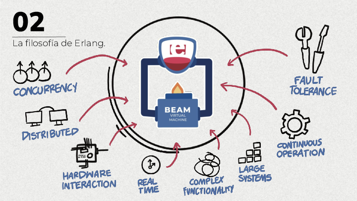

`Propiedades de un sistema de telecomunicaciones`
- `Concurrency` El sistema debe ser capaz de procesar un alto número de actividades concurrentes.
- `Soft real-time` Las acciones se deben ser procesadas en un punto en el tiempo.
- `Distributed` Los sistemas deben ser distribuídos.
- `Hardware interaction` El sistema usará control de hardware.
- `Large software systems` Los sistemas de software son grandes.
- `Complex functionality` Gran complejidad en las funcionalidades.
- `Continuous operation` Los sistemas deben continuar en operación por muchos años.
- `Quality requirements` Confiabilidad y calidad en los requerimientos de software.
- `Fault tolerance` Tolerancia a fallos.

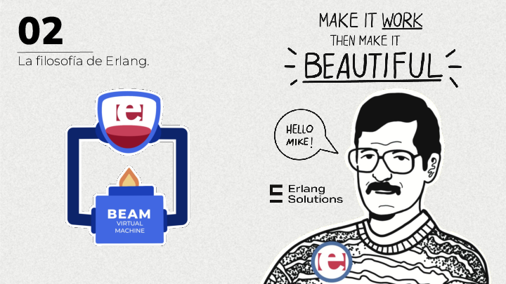

## 3. Procesos en la BEAM

Los `procesos` son un concepto central en la elaboración de sistemas en la BEAM, es la unidad principal de trabajo con el que puedes diseñar soluciones que hagan uso de todas las capacidades de Erlang.

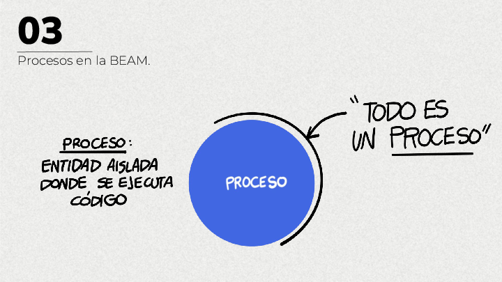

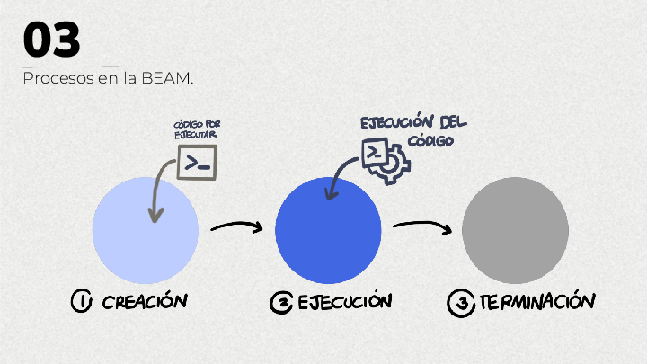

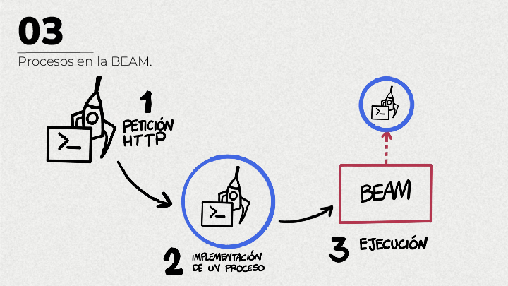

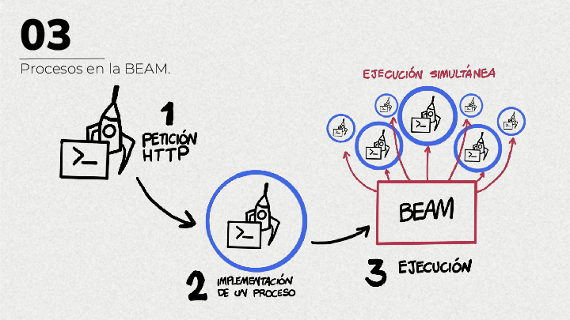

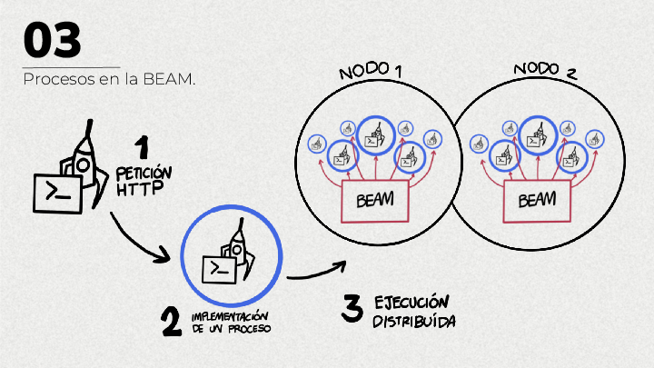

## 4. Elixir como lenguaje de la BEAM

Sobre los conceptos anteriores está construído Elixir, un lenguaje de propósito general que hereda todas las ventajas de la BEAM, sin embargo Elixir debe considerarse como un lenguaje por aparte, ya que al ser de propósito general y funcional te facilita ciertos caminos para aprenderlo y comenzar a construir aplicaciones con él.

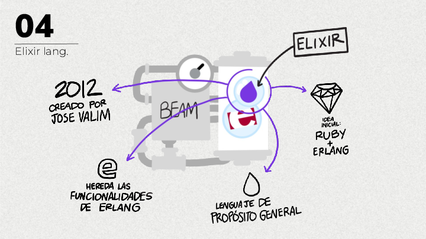

## 5. Nociones Básicas de Elixir

A diferencia de la Orientación a Objetos, Elixir maneja módulos que contienen funciones que ejecutan la lógica de programación.

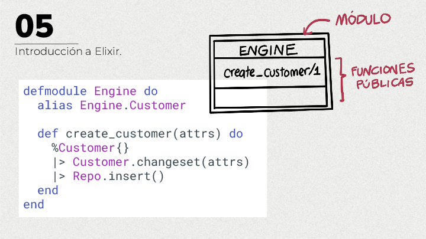

Una vez que construyes tus módulos, puedes invocarlos entre ellos, de igual forma las dependencias externas son módulos que invocas directamente en tu proyecto. De forma muy sencilla así se ve la interacción entre unos cuantos módulos:

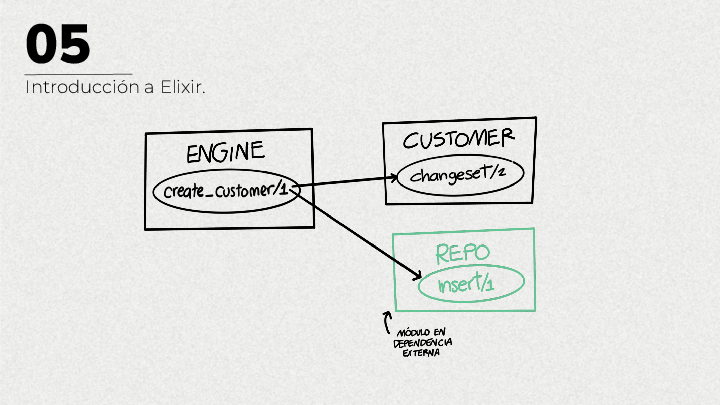

Si bien Elixir es un lenguaje funcional, cabe destacar la importancia de pensar en transformación de datos, es decir, pensar en `input` como entrada de información que por medio de una función se transformará en un `output`.

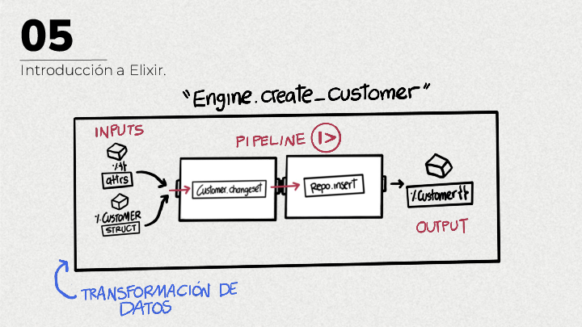

## 6. Sistemas en Elixir

Aunque Erlang y la BEAM son tecnologías muy poderosas, Elixir es un lenguaje que te facilita hacer cualquier tarea cotidiana, no necesitas usar concurrencia y distribución desde el inicio, ya que es una opción que te habilita el mismo ecosistema si así lo necesitas. Por lo que Elixir es una gran opción incluso para developers novatos que estén buscando un buen lenguaje de programación.

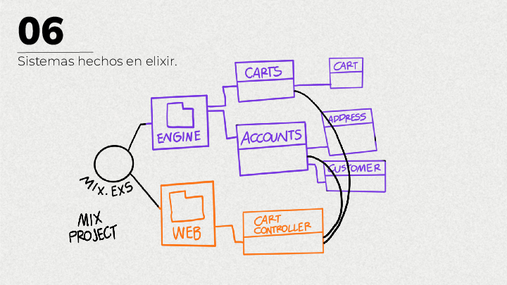

## 7. Sistemas en Erlang

La gran noticia es que todas las capacidades de la BEAM están disponibles en Elixir, esto quiere decir que en un momento dado puedes comenzar a diseñar componentes que aprovechen estas características, para ello será necesario diseñar en procesos, para lo cuál será necesario aprender cómo funcionan los diseños de OTP que te facilitarán mucho este paso.

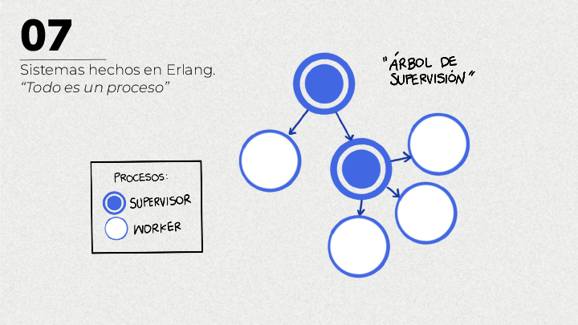

## 8. Sistemas en la BEAM

Con Elixir es posible crear una aplicación sin pensar en nada de concurrencia y distribución, estos features son una opción que puedes implementar en cierto momento dado, ya que son capacidades que te otorga la máquina virtual de Erlang.

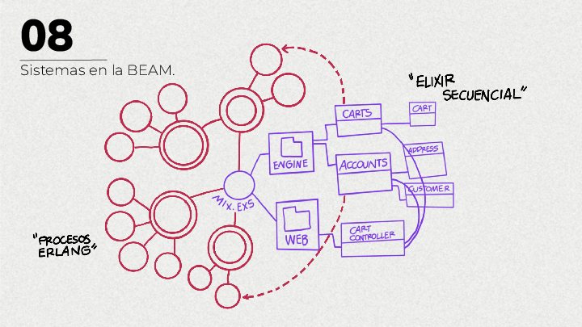

## 9. El ecosistema de Elixir

- [Phoenix Framework](https://www.phoenixframework.org/)
- [Ecto Db](https://hexdocs.pm/ecto/Ecto.html)
- [Nx](https://github.com/elixir-nx/)
- [Nerves](https://nerves-project.org/)
- [Native LiveViews](https://native.live/)

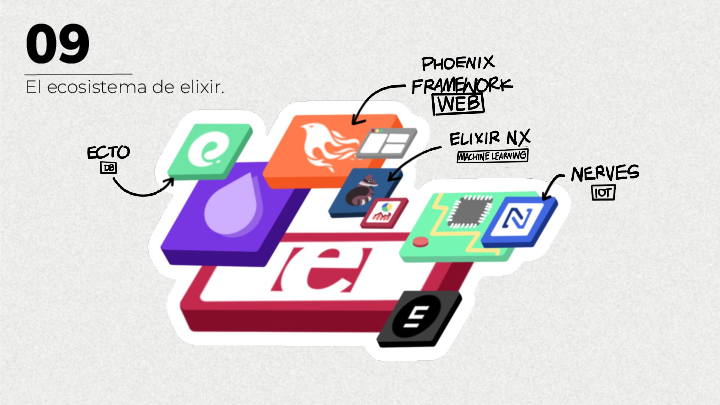

## 10. Una app en elixir.

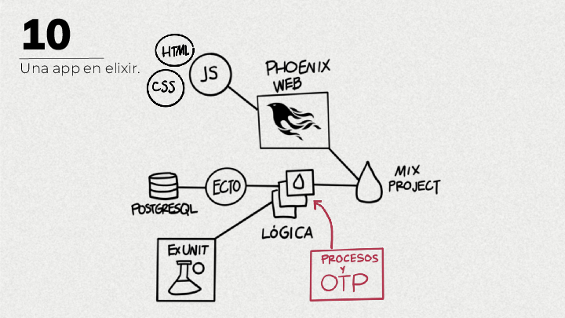

## 11. Phoenix Live views

En el 2019 se anunció LiveViews como un nuevo componente para crear features en el front-end usando solamente Elixir y dejándo de lado Javascript. Este proyecto funciona a traves de websockets, cada cliente se conecta a un socket, y por medio de este es como se va actualizando la vista en el navegador. 

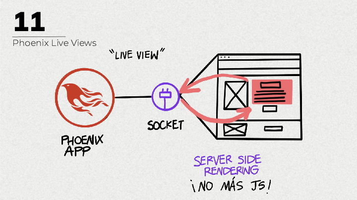

Este es un buen ejemplo de cómo hacer uso de procesos y OTP para diseñar componentes, ya que detrás de cada conexión por socket, hay un proceso de Erlang que se encarga de administrarlo. 

## 12. Productividad con Elixir

## 13. ¿Por donde comenzar?

